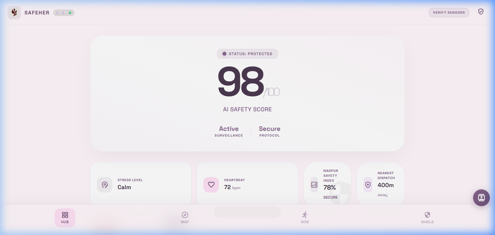
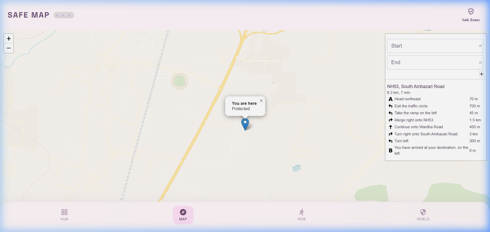
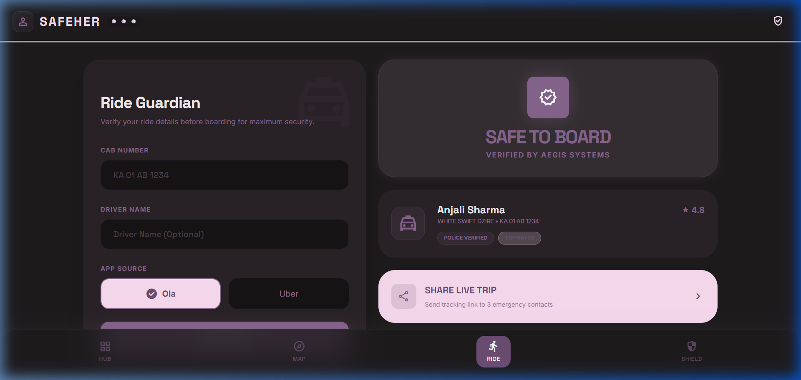
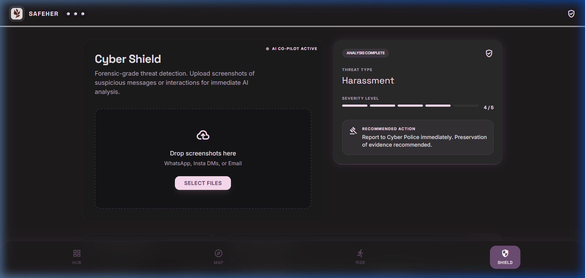

# SafeHer - Next-Generation Women Safety Platform

SafeHer is an AI-powered safety ecosystem designed to empower women with instant distress detection, live evidence capturing, and community-driven safety insights. Using a combination of voice recognition, motion analysis, and real-time streaming, SafeHer ensures that help is only a whisper or a shake away.

## 🚀 Key Features

- **AI SOS Trigger**: Instant emergency protocol activated via **Voice Recognition** (shouting "Help!") and **Motion Detection** (violent shaking).
- **Live Evidence Streaming**: Automatically records and broadcasts video/audio from both front and rear cameras during an SOS event.
- **Nagpur Crime Map**: Interactive heatmap visualization of safe and high-risk zones, integrating local crime data for smarter navigation.
- **Ride Guardian**: Real-time tracking and safety monitoring for commutes, with automated alerts for deviations.
- **Cyber Shield**: Integrated tools for digital safety and reporting online harassment.
- **PWA (Progressive Web App)**: Installable on any Android or iOS device for offline access and native-like performance.

## 🖼️ Application showcase


*Safety Hub: AI safety score and system status.*


*Safe Map: Interactive crime data and real-time navigation.*


*Ride Guardian: Secure cab verification and trip sharing.*


*Cyber Shield: Forensic-grade threat detection for online harassment.*

## 🛠️ Tech Stack

### Frontend
- **HTML5/CSS3/JavaScript (ES6+)**
- **PWA**: Service Workers & Web Manifest
- **Mapbox/Leaflet**: Interactive geospatial visualizations
- **WebRTC**: Real-time media handling

### Backend
- **Node.js & Express**: Scalable API architecture
- **MongoDB**: Robust data persistence
- **Socket.io**: Real-time bidirectional SOS signaling
- **Twilio API**: Global SMS and Voice Call alerts

## 🏁 Quick Start

### Prerequisites
- [Node.js](https://nodejs.org/) (v16+)
- [MongoDB](https://www.mongodb.com/try/download/community) installed and running locally
- [Ngrok](https://ngrok.com/) (Required for Camera/Mic access on mobile browsers)

### Installation

1. **Clone the repository**
   ```bash
   git clone https://github.com/your-username/safeher.git
   cd safeher
   ```

2. **Setup Backend**
   ```bash
   cd backend
   npm install
   cp .env.example .env
   # Edit .env with your MongoDB URI and Twilio credentials
   ```

3. **Start the Server**
   ```bash
   npm run dev
   ```

4. **Expose to Mobile (Ngrok)**
   ```bash
   ngrok http 3000
   ```
   *Copy the `https://` link and open it on your mobile device.*

## 📂 Project Structure

```
safeher/
├── backend/            # Express Server & API
│   ├── src/            # Source code (models, routes, sockets)
│   └── .env.example    # Environment template
├── frontend/
│   └── public/         # PWA assets (HTML, JS, CSS, Media)
├── LICENSE             # MIT License
└── README.md           # This file
```

## 🛡️ Presentation Guide
For a detailed step-by-step on how to demo the platform, see [PRESENTATION_GUIDE.md](./PRESENTATION_GUIDE.md).

## 📄 License
This project is licensed under the MIT License - see the [LICENSE](LICENSE) file for details.

---
*Built with ❤️ for safety and empowerment.*
